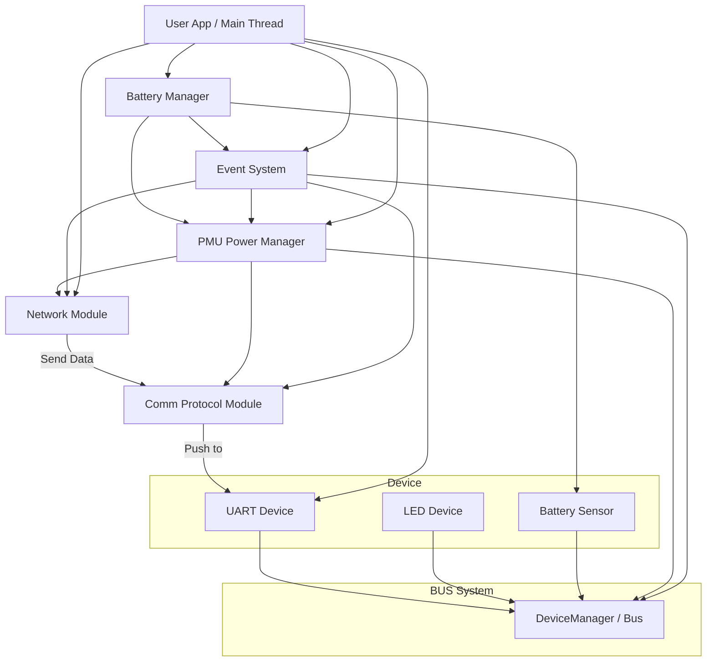
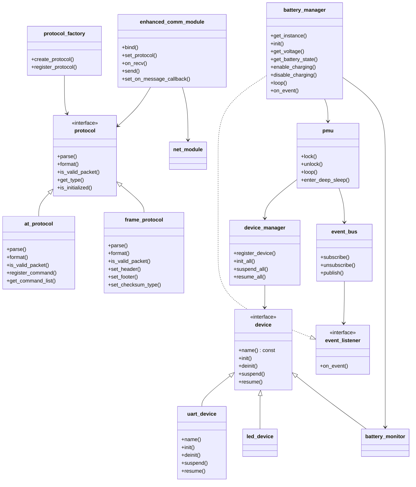

---

# 🌐 ESP32S3 基于 TCP 的多设备框架设计文档（C++）

---

## 📌 项目目标

在 ESP32S3 平台上，实现一个**通过 UART 接收数据并通过 WiFi 发送到远端 TCP 服务**的系统，支持多设备抽象管理、低功耗控制（PMU）、模块解耦、协议分离。整个架构需符合：

- ✅ **SOLID 原则**
- ✅ **RAII 资源管理**
- ✅ **可扩展 BUS 总线设计**
- ✅ **良好的模块职责划分**
- ✅ **基于事件的发布订阅模式**
- ✅ **智能电池管理系统**


---

## 🧱 系统架构概览



---

## ⚙️ 模块划分 & 职责

|模块|说明|
|---|---|
|`device` 接口类|定义所有外设统一操作接口（初始化、挂起、恢复等）|
|`bus` 管理器|管理所有挂载的设备，并可广播调用生命周期接口（如 `suspend`）|
|`pmu` 电源管理器|倒计时进入低功耗状态的控制器，基于锁机制|
|`net_module` 网络|负责 WiFi 配置、TCP 建连与数据收发|
|`comm_module` 通讯|负责协议封包/解包，提供 `on_recv/on_send` 回调接口|
|`event_system` 事件系统|实现发布订阅模式，管理事件广播与订阅|
|`battery_manager` 电池管理|负责电池状态监控、充电控制、低电量策略|
|`main_loop`|用户主循环，协调其他模块、注册设备与逻辑控制|

---

## 🧩 设备抽象设计

```cpp
class device {
public:
    virtual const char* name() const = 0;
    virtual int init() = 0;
    virtual int deinit() = 0;
    virtual int suspend() = 0;
    virtual int resume() = 0;
    virtual ~device() = default;
};
```

**具体设备示例：**

- `uart_device : public device`
    
- `led_device : public device`
    
- `battery_monitor : public device`
    

---

## 🔌 BUS 总线 & 设备管理器

```cpp
class device_manager {
public:
    void register_device(std::shared_ptr<device> dev);
    void init_all();
    void suspend_all();
    void resume_all();
    std::shared_ptr<device> get_device_by_name(const std::string& name);
private:
    std::vector<std::shared_ptr<device>> devices_;
};
```

> ✨ 设计点：
> 
> - 使用 `shared_ptr` 保证资源在作用域内有效
>     
> - 支持动态注册、遍历和批量操作
>     

---

## 🌙 PMU 电源管理器（锁机制）

```cpp
class pmu {
public:
    void lock();   // 保持活跃
    void unlock(); // 允许低功耗
    void loop();   // 定时轮询检查
    void enter_deep_sleep(uint32_t sleep_time_ms = 0);  // 进入深度睡眠

private:
    std::atomic<bool> is_locked_;
    std::chrono::steady_clock::time_point last_unlock_time_;
    const std::chrono::seconds idle_timeout_ = std::chrono::seconds(10);

    device_manager& dev_mgr_;
};
```

> ✨ 特点：
> 
> - **非抢占式锁**
>     
> - **倒计时自动休眠**，通过 `suspend_all()` 调用所有设备进入低功耗
>     

---

## 🌐 网络模块（WiFi + TCP）

```cpp
class net_module {
public:
    bool connect_wifi(const std::string& ssid, const std::string& pass);
    bool connect_tcp(const std::string& host, uint16_t port);
    bool send(const std::vector<uint8_t>& data);
    void loop(); // 接收数据 & 调用 comm_module

private:
    int sock_fd_;
    comm_module* comm_; // 绑定的协议模块
};
```

> 使用 RAII 管理 socket 打开与关闭。

---

## 🔄 协议抽象层

为了支持多种协议类型，需要引入协议抽象层，提供统一的协议接口：

```cpp
// 协议类型枚举
enum class protocol_type {
    at_protocol,       // AT命令协议
    frame_protocol,    // 帧格式协议
    modbus_protocol,   // Modbus协议
    custom_protocol    // 自定义协议
};

// 协议抽象基类
class protocol {
public:
    virtual ~protocol() = default;
    
    // 协议核心接口
    virtual bool parse(const std::vector<uint8_t>& data, std::string& message) = 0;
    virtual bool format(const std::string& message, std::vector<uint8_t>& data) = 0;
    
    // 协议识别接口
    virtual bool is_valid_packet(const std::vector<uint8_t>& data) = 0;
    virtual protocol_type get_type() const = 0;
    
    // 检查协议状态
    virtual bool is_initialized() const = 0;
};

// 协议工厂
class protocol_factory {
public:
    static std::shared_ptr<protocol> create_protocol(protocol_type type);
    static void register_protocol(protocol_type type, 
                                 std::function<std::shared_ptr<protocol>()> creator);
};

// 增强版通讯模块
class enhanced_comm_module {
public:
    // 绑定网络模块
    void bind(net_module* net);
    
    // 设置当前协议
    void set_protocol(protocol_type type);
    void set_protocol(std::shared_ptr<protocol> protocol);
    
    // 获取当前协议
    std::shared_ptr<protocol> get_protocol() const;
    
    // 数据收发
    void on_recv(const std::vector<uint8_t>& data);
    bool send(const std::string& message);
    
    // 事件回调注册
    void set_on_message_callback(std::function<void(const std::string&)> callback);
};
```

### AT协议接口

```cpp
class at_protocol : public protocol {
public:
    // Protocol接口实现
    bool parse(const std::vector<uint8_t>& data, std::string& message) override;
    bool format(const std::string& message, std::vector<uint8_t>& data) override;
    bool is_valid_packet(const std::vector<uint8_t>& data) override;
    protocol_type get_type() const override;
    bool is_initialized() const override;
    
    // AT命令解析器
    void register_command(const std::string& cmd, 
                         std::function<std::string(const std::vector<std::string>&)> handler);
    std::vector<std::string> get_command_list() const;
};
```

### 帧协议接口

```cpp
class frame_protocol : public protocol {
public:
    // Protocol接口实现
    bool parse(const std::vector<uint8_t>& data, std::string& message) override;
    bool format(const std::string& message, std::vector<uint8_t>& data) override;
    bool is_valid_packet(const std::vector<uint8_t>& data) override;
    protocol_type get_type() const override;
    bool is_initialized() const override;
    
    // 帧协议配置
    void set_header(uint16_t header);
    void set_footer(uint16_t footer);
    void set_max_frame_size(size_t size);
    
    // 帧校验方法
    enum class checksum_type {
        none,
        xor_sum,
        crc16,
        crc32
    };
    
    void set_checksum_type(checksum_type type);
};
```

### AT协议与Frame协议对比

| 特性 | AT协议 | Frame协议 |
|------|---------|-----------|
| 可读性 | 高（文本格式） | 低（二进制格式） |
| 数据效率 | 低（ASCII编码） | 高（二进制编码） |
| 校验机制 | 简单（基于文本） | 复杂（CRC等校验和） |
| 适用场景 | 手动调试、简单通信 | 高效数据传输、嵌入式设备间通信 |
| 解析复杂度 | 低 | 中 |
| 支持的数据类型 | 字符串、数字 | 任意二进制数据 |

### Frame协议格式

```
[帧头(2字节)][长度(2字节)][命令(1字节)][数据(N字节)][校验和(2字节)][帧尾(2字节)]
```

示例帧：
```
AA AA 00 0A 01 48 65 6C 6C 6F 23 45 55 55
```
- 帧头: 0xAAAA
- 长度: 0x000A (10字节)
- 命令: 0x01
- 数据: "Hello" (0x48 0x65 0x6C 0x6C 0x6F)
- 校验和: 0x2345
- 帧尾: 0x5555

---

## 📢 事件系统（发布订阅模式）

```cpp
// 事件类型定义
enum class event_type {
    network_connected,
    network_disconnected,
    data_received,
    battery_low,
    battery_critical,
    battery_normal,
    charging_started,
    charging_complete,
    battery_temp_high,
    battery_temp_normal,
    device_error,
    enter_deep_sleep
};

// 事件数据结构
struct event_data {
    event_type type;
    std::any payload;  // 使用 std::any 存储不同类型的事件数据
    
    template<typename T>
    T get_value() const;
};

// 事件处理接口
class event_listener {
public:
    virtual void on_event(const event_data& event) = 0;
    virtual ~event_listener() = default;
};

// 事件管理器
class event_bus {
public:
    // 单例模式
    static event_bus& get_instance();

    // 注册监听器
    void subscribe(event_type type, std::shared_ptr<event_listener> listener);
    
    // 取消监听器
    void unsubscribe(event_type type, std::shared_ptr<event_listener> listener);
    
    // 发布事件
    void publish(const event_data& event);
};
```

---

## 🔋 电池管理模块

```cpp
// 电池状态枚举
enum class battery_state {
    critical,   // 电量严重不足（<10%）
    low,        // 电量不足（<20%）
    normal,     // 正常电量（20%-80%）
    high,       // 高电量（>80%）
    full,       // 满电（100%）
    charging,   // 充电中
    error       // 电池错误
};

// 充电状态枚举
enum class charging_state {
    not_charging,    // 未充电
    fast_charging,   // 快速充电
    slow_charging,   // 慢速充电
    trickle_charging,// 涓流充电
    complete,        // 充电完成
    error            // 充电错误
};

// 电池管理器
class battery_manager : public event_listener {
public:
    // 单例模式
    static battery_manager& get_instance();
    
    // 初始化电池管理器
    bool init(std::shared_ptr<device> battery_device, pmu& pmu);
    
    // 获取电池信息
    float get_voltage() const;
    float get_current() const;
    float get_temperature() const;
    int get_charge_percentage() const;
    battery_state get_battery_state() const;
    charging_state get_charging_state() const;
    
    // 充电控制
    bool enable_charging();
    bool disable_charging();
    bool set_charging_current(uint16_t mA);
    
    // 电源策略
    void set_low_battery_threshold(int percentage);
    void set_critical_battery_threshold(int percentage);
    
    // 循环检查
    void loop();
    
    // 事件处理
    void on_event(const event_data& event) override;
};
```

---

## 📐 类关系 UML 图



---

## ✨ 事件系统集成示例

**设备如何监听事件**：
- 实现 `event_listener` 接口的 `on_event()` 方法
- 在系统初始化时注册监听特定类型的事件
- 响应事件并执行相应操作

**电池事件使用案例**：
- 电池低电量事件触发LED指示
- 网络连接/断开事件调整电池检测频率
- 温度过高事件禁用充电功能

**发布事件的时机**：
- 网络状态变化时
- 电池电量变化超过阈值时
- 硬件错误发生时
- 数据接收完成时

---

## ♻️ 资源管理（RAII 实践）

|对象|资源|RAII 策略|
|---|---|---|
|`uart_device`|`uart_driver_install`|构造注册 / 析构释放|
|`net_module`|socket 描述符（fd）|构造打开 / 析构关闭|
|`pmu`|状态位、定时器|构造初始化|
|`std::shared_ptr`|所有设备对象生命周期管理|自动释放|
|`comm_module`|无状态 / 绑定关系|生命周期绑定|
|`event_bus`|事件订阅关系|使用weak_ptr避免循环引用|
|`battery_manager`|电池设备引用|使用weak_ptr管理设备生命周期|

---

## ✅ SOLID 原则落地说明

|原则|实现示例|
|---|---|
|S（单一职责）|每个模块（如 UART、Net、EventBus）职责单一，互不干扰|
|O（开闭原则）|设备类通过继承 `device`，事件通过 `event_type` 枚举扩展，不需修改框架|
|L（里氏替换）|`bus` 仅依赖于 `device` 接口，`event_bus` 仅依赖于 `event_listener` 接口|
|I（接口隔离）|模块使用精细的接口，如 `event_listener` 仅定义 `on_event()`，没有冗余依赖|
|D（依赖反转）|通讯和事件系统依赖抽象接口，而非具体实现|

---

## 🔄 事件系统优势

- **解耦性**：发布者无需了解订阅者，订阅者无需了解发布者
- **可扩展性**：添加新事件类型不需修改现有代码
- **灵活性**：一个事件可以有多个监听器，一个监听器可以处理多种事件
- **代码简化**：减少各模块间的直接调用，使代码更加清晰
- **可测试性**：通过模拟事件发布，方便单元测试

## 🔋 电池管理策略

- **动态功耗调整**：根据电量状态自动调整系统功耗（WiFi发射功率、CPU频率）
- **智能充电控制**：基于温度和电池健康状态调整充电电流
- **预警机制**：通过LED闪烁和网络事件通知低电量状态
- **深度睡眠**：临界电量时自动进入超低功耗模式保护电池
- **充电状态监控**：实时监控充电电流和电压，确保安全充电
- **电池健康管理**：通过跟踪充放电周期优化电池寿命 