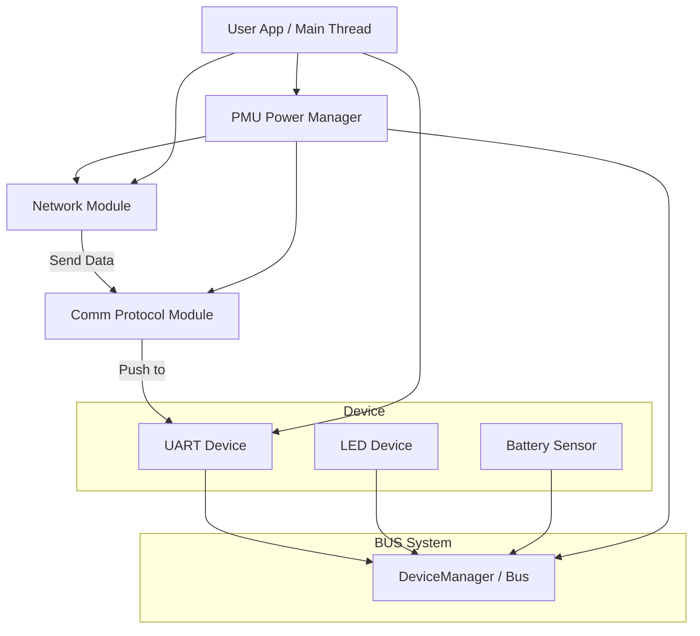
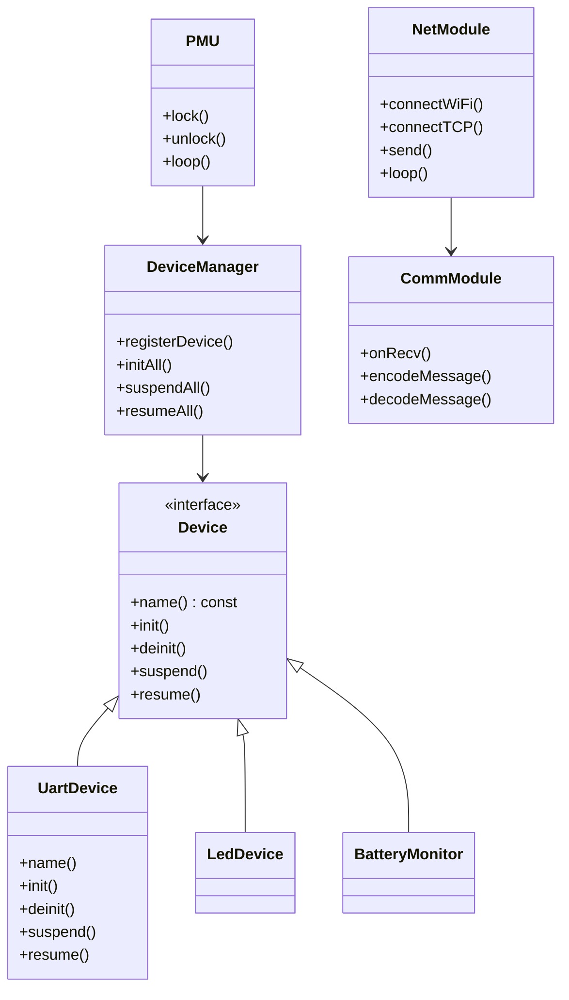

---

# 🌐 ESP32S3 基于 TCP 的多设备框架设计文档（C++）

---

## 📌 项目目标

在 ESP32S3 平台上，实现一个**通过 UART 接收数据并通过 WiFi 发送到远端 TCP 服务**的系统，支持多设备抽象管理、低功耗控制（PMU）、模块解耦、协议分离。整个架构需符合：

- ✅ **SOLID 原则**
- ✅ **RAII 资源管理**
- ✅ **可扩展 BUS 总线设计**
- ✅ **良好的模块职责划分**


---

## 🧱 系统架构概览



---

## ⚙️ 模块划分 & 职责

|模块|说明|
|---|---|
|`Device` 接口类|定义所有外设统一操作接口（初始化、挂起、恢复等）|
|`Bus` 管理器|管理所有挂载的设备，并可广播调用生命周期接口（如 `suspend`）|
|`PMU` 电源管理器|倒计时进入低功耗状态的控制器，基于锁机制|
|`NetModule` 网络|负责 WiFi 配置、TCP 建连与数据收发|
|`CommModule` 通讯|负责协议封包/解包，提供 `onRecv/onSend` 回调接口|
|`MainLoop`|用户主循环，协调其他模块、注册设备与逻辑控制|

---

## 🧩 设备抽象设计

```cpp
class Device {
public:
    virtual const char* name() const = 0;
    virtual int init() = 0;
    virtual int deinit() = 0;
    virtual int suspend() = 0;
    virtual int resume() = 0;
    virtual ~Device() = default;
};
```

**具体设备示例：**

- `UartDevice : public Device`
    
- `LedDevice : public Device`
    
- `BatteryMonitor : public Device`
    

---

## 🔌 BUS 总线 & 设备管理器

```cpp
class DeviceManager {
public:
    void registerDevice(std::shared_ptr<Device> dev);
    void initAll();
    void suspendAll();
    void resumeAll();
    std::shared_ptr<Device> getDeviceByName(const std::string& name);
private:
    std::vector<std::shared_ptr<Device>> devices_;
};
```

> ✨ 设计点：
> 
> - 使用 `shared_ptr` 保证资源在作用域内有效
>     
> - 支持动态注册、遍历和批量操作
>     

---

## 🌙 PMU 电源管理器（锁机制）

```cpp
class PMU {
public:
    void lock();   // 保持活跃
    void unlock(); // 允许低功耗
    void loop();   // 定时轮询检查

private:
    std::atomic<bool> is_locked_;
    std::chrono::steady_clock::time_point last_unlock_time_;
    const std::chrono::seconds idle_timeout_ = std::chrono::seconds(10);

    DeviceManager& dev_mgr_;
};
```

> ✨ 特点：
> 
> - **非抢占式锁**
>     
> - **倒计时自动休眠**，通过 `suspendAll()` 调用所有设备进入低功耗
>     

---

## 🌐 网络模块（WiFi + TCP）

```cpp
class NetModule {
public:
    bool connectWiFi(const std::string& ssid, const std::string& pass);
    bool connectTCP(const std::string& host, uint16_t port);
    bool send(const std::vector<uint8_t>& data);
    void loop(); // 接收数据 & 调用 CommModule

private:
    int sock_fd_;
    CommModule* comm_; // 绑定的协议模块
};
```

> 使用 RAII 管理 socket 打开与关闭。

---

## 📡 通讯模块（协议分离）

```cpp
class CommModule {
public:
    void bind(NetModule* net);
    void onRecv(const std::vector<uint8_t>& data);
    std::vector<uint8_t> encodeMessage(const std::string& payload);
    std::string decodeMessage(const std::vector<uint8_t>& raw);
};
```

> ✨ 解耦协议处理逻辑，可替换为 Modbus、自定义 TLV 等协议。

---

## 📐 类关系 UML 图



---

## ♻️ 资源管理（RAII 实践）

|对象|资源|RAII 策略|
|---|---|---|
|`UartDevice`|`uart_driver_install`|构造注册 / 析构释放|
|`NetModule`|socket 描述符（fd）|构造打开 / 析构关闭|
|`PMU`|状态位、定时器|构造初始化|
|`std::shared_ptr`|所有设备对象生命周期管理|自动释放|
|`CommModule`|无状态 / 绑定关系|生命周期绑定|

---

## 🔁 典型调用流程

```cpp
int main() {
    DeviceManager bus;
    PMU pmu(bus);
    NetModule net;
    CommModule comm;

    net.bind(&comm);

    bus.registerDevice(std::make_shared<UartDevice>());
    bus.registerDevice(std::make_shared<LedDevice>());
    bus.registerDevice(std::make_shared<BatteryMonitor>());

    bus.initAll();

    while (true) {
        net.loop();  // 检查并处理接收数据
        pmu.loop();  // 检查是否进入低功耗
        std::this_thread::sleep_for(std::chrono::milliseconds(100));
    }
}
```

---

## ✅ SOLID 原则落地说明

|原则|实现示例|
|---|---|
|S（单一职责）|每个模块（如 UART、Net）职责单一，互不干扰|
|O（开闭原则）|设备类通过继承 `Device`，扩展不需改动框架|
|L（里氏替换）|`Bus` 仅依赖于 `Device` 接口，不关心实现细节|
|I（接口隔离）|模块使用精细的接口（如 `NetModule::send()`），没有冗余依赖|
|D（依赖反转）|通讯依赖抽象（绑定 `CommModule` 接口）|
